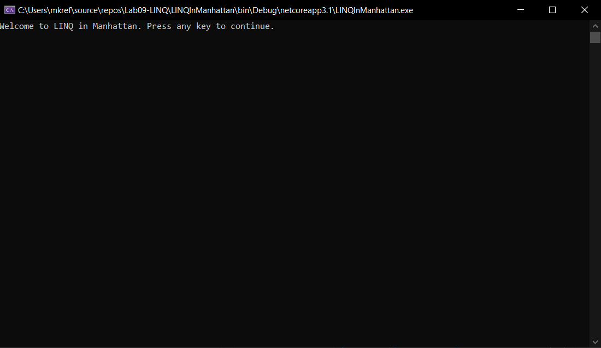
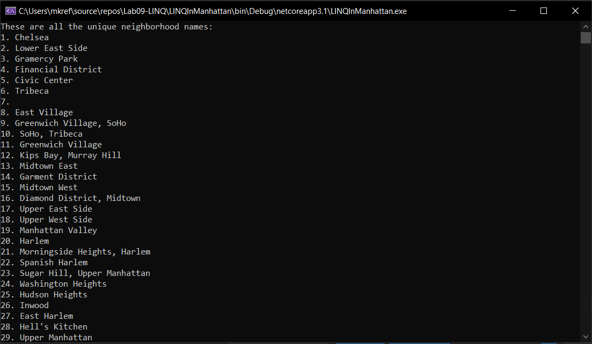
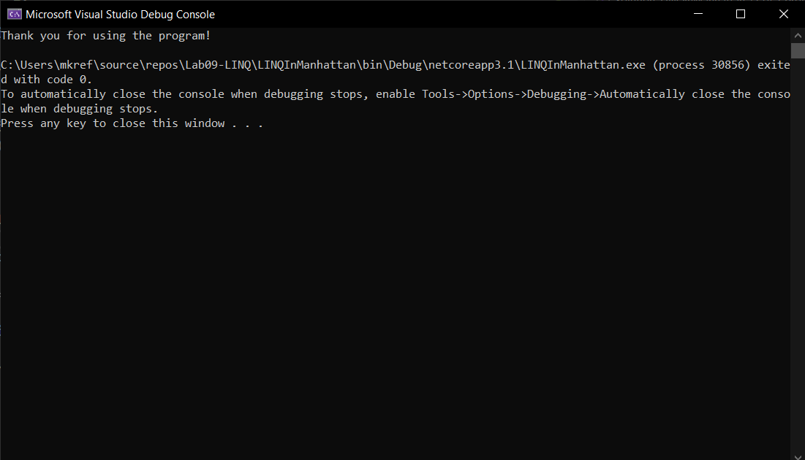

# LINQ in Manhattan

Lab09-LINQ

*Author: Michael Refvem*

----

## Description
This is a C# console application that displays a list of neighborhoods in Manhattan using various LINQ query calls. Neighborhood data is stored in a JSON file which is reference by the project using Newtonsoft LINQ to JSON.

---

### Getting Started
Clone this repository to your local machine.

```
$ git clone https://github.com/MRefvem/Lab09-LINQ
```

### To run the program from Visual Studio:
Select ```File``` -> ```Open``` -> ```Project/Solution```

Next navigate to the location you cloned the Repository.

Double click on the file ```LINQInManhattan```

Then select and open ```LINQInManhattan.sln```

---

### Visuals

#### Application Start

#### Using the Application

#### Application End


---

### Change Log
***[The change log will list any changes made to the code base. This includes any changes from TA/Instructor feedback]***  
1.3: *README for this lab is complete* - 16 Jul 2010  
1.2: *Feature tasks for this lab are completed* - 16 Jul 2010  
1.1: *initial commit* - 16 Jul 2020  